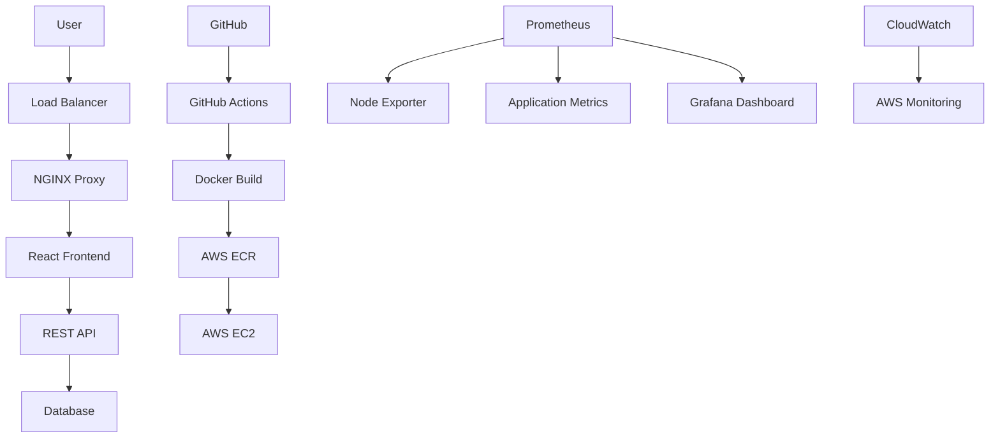

# 💰 Cloud-Native Personal Finance Dashboard

[](https://www.docker.com/)
[](https://reactjs.org/)
[](https://aws.amazon.com/)
[](https://prometheus.io/)
[](https://nginx.org/)
[](https://github.com/features/actions)

A modern, responsive personal finance dashboard built with React and enhanced with comprehensive DevOps practices. This project demonstrates the complete software development lifecycle from development to production deployment with monitoring, containerization, and CI/CD automation.


## 📋 Table of Contents

- [Features](#-features)
- [Architecture](#-architecture)
- [Tech Stack](#-tech-stack)
- [Quick Start](#-quick-start)
- [Docker Setup](#-docker-setup)
- [CI/CD Pipeline](#-cicd-pipeline)
- [Monitoring & Observability](#-monitoring--observability)
- [Cloud Deployment](#-cloud-deployment)
- [Performance & Security](#-performance--security)
- [Contributing](#-contributing)

## ✨ Features

### 📊 **Data Visualization**
- Interactive charts and graphs using Chart.js
- Expense breakdown by categories (pie charts)
- Spending trends over time (line charts)
- Budget vs. actual spending comparisons
- Custom date range analytics

### 🎨 **User Experience**
- Fully responsive design with Bootstrap
- Intuitive and modern UI/UX
- Dark/light theme support
- Mobile-first approach
- Real-time data updates

### 🔧 **DevOps & Infrastructure**
- Multi-service containerization with Docker Compose
- NGINX reverse proxy with load balancing
- Comprehensive logging and monitoring
- Automated health checks and alerting
- CI/CD pipeline with GitHub Actions
- Cloud-ready deployment architecture

## 🏗️ Architecture



## 🛠️ Tech Stack

### **Frontend & UI**
| Technology | Purpose | Version |
|------------|---------|---------|
|  | Core Framework | ^18.2.0 |
|  | UI Framework | ^5.3.0 |
|  | Data Visualization | ^4.0.0 |
|  | Programming Language | ES6+ |

### **DevOps & Infrastructure**
| Technology | Purpose | Version |
|------------|---------|---------|
|  | Containerization | ^24.0.0 |
|  | Multi-container Orchestration | ^2.20.0 |
|  | Reverse Proxy & Web Server | ^1.24.0 |
|  | CI/CD Pipeline | Latest |

### **Monitoring & Observability**
| Technology | Purpose | Version |
|------------|---------|---------|
|  | Metrics Collection | ^2.45.0 |
|  | Metrics Visualization | ^10.0.0 |
| Node Exporter | System Metrics | ^1.6.0 |

### **Cloud & Deployment**
| Technology | Purpose | Version |
|------------|---------|---------|
|  | Compute Platform | Latest |
|  | Static Asset Storage | Latest |
|  | Load Balancing | Latest |

## 🚀 Quick Start

### Prerequisites

Ensure you have the following installed:
-  **Docker** (v20.0.0+)
-  **Docker Compose** (v2.0.0+)
-  **Node.js** (v16.0.0+) - for local development
-  **Git**

### Installation & Setup

1. **Clone the repository**
   ```bash
   git clone https://github.com/SyedNasir9/personal-finance-dashboard.git
   cd personal-finance-dashboard
   ```

2. **Environment Configuration**
   ```bash
   # Copy environment template
   cp .env.example .env
   
   # Edit configuration values
   nano .env
   ```

3. **Start all services with Docker Compose**
   ```bash
   # Build and start all services
   docker-compose up --build -d
   
   # View logs
   docker-compose logs -f
   ```

4. **Access the application**
   - 🌐 **Web Application**: http://localhost:80
   - 📊 **Prometheus**: http://localhost:9090
   - 📈 **Grafana**: http://localhost:3001 (admin/admin)
   - 🔍 **NGINX Status**: http://localhost:8080

## 🐳 Docker Setup

### Multi-Service Architecture

Our application uses Docker Compose to orchestrate multiple services:

```yaml
version: '3.8'
services:
  frontend:
    build: .
    container_name: finance-dashboard
    restart: unless-stopped
    
  nginx:
    image: nginx:alpine
    container_name: finance-proxy
    ports:
      - "80:80"
      - "443:443"
    volumes:
      - ./nginx/nginx.conf:/etc/nginx/nginx.conf
      - ./nginx/logs:/var/log/nginx
    depends_on:
      - frontend
      
  prometheus:
    image: prom/prometheus:latest
    container_name: finance-prometheus
    ports:
      - "9090:9090"
    volumes:
      - ./monitoring/prometheus.yml:/etc/prometheus/prometheus.yml
      
  node-exporter:
    image: prom/node-exporter:latest
    container_name: finance-node-exporter
    ports:
      - "9100:9100"
```

### Individual Service Commands

```bash
# Build frontend only
docker build -t finance-dashboard .

# Run frontend container
docker run -p 3000:3000 finance-dashboard

# Check container logs
docker logs finance-dashboard -f

# Execute commands in container
docker exec -it finance-dashboard /bin/sh
```

## 🔄 CI/CD Pipeline

### GitHub Actions Workflow

Our automated pipeline includes comprehensive testing, building, and deployment:

```yaml
name: CI/CD Pipeline

on:
  push:
    branches: [ main, develop ]
  pull_request:
    branches: [ main ]

jobs:
  test:
    runs-on: ubuntu-latest
    steps:
      - uses: actions/checkout@v3
      - name: Setup Node.js
        uses: actions/setup-node@v3
        with:
          node-version: '18'
      - name: Install dependencies
        run: npm ci
      - name: Run tests
        run: npm test
      - name: Run linting
        run: npm run lint

  build:
    needs: test
    runs-on: ubuntu-latest
    steps:
      - uses: actions/checkout@v3
      - name: Build Docker image
        run: docker build -t finance-dashboard .
      - name: Push to registry
        run: |
          echo ${{ secrets.DOCKER_PASSWORD }} | docker login -u ${{ secrets.DOCKER_USERNAME }} --password-stdin
          docker push finance-dashboard:latest

  deploy:
    needs: build
    runs-on: ubuntu-latest
    if: github.ref == 'refs/heads/main'
    steps:
      - name: Deploy to AWS EC2
        run: |
          # Deployment script here
```

### Pipeline Stages

1. **🧪 Test Stage**: Unit tests, integration tests, code quality checks
2. **🔨 Build Stage**: Docker image creation and optimization
3. **🔍 Security Scan**: Container vulnerability scanning
4. **📦 Push Stage**: Upload to container registry
5. **🚀 Deploy Stage**: Automated deployment to production

## 📊 Monitoring & Observability

### Prometheus Metrics

Our monitoring stack collects comprehensive metrics:

#### Application Metrics
- 📈 **Response Times**: API endpoint performance
- 🔢 **Request Counts**: Traffic volume and patterns
- ❌ **Error Rates**: 4xx and 5xx error tracking
- 👥 **Active Users**: Real-time user sessions

#### System Metrics
- 💾 **Memory Usage**: RAM consumption and trends
- ⚡ **CPU Utilization**: Processor load monitoring
- 💿 **Disk Usage**: Storage consumption tracking
- 🌐 **Network I/O**: Bandwidth utilization

### Grafana Dashboards

Pre-configured dashboards include:

1. **Application Overview**: High-level health metrics
2. **System Performance**: Infrastructure monitoring
3. **User Analytics**: Usage patterns and behavior
4. **Error Tracking**: Issue identification and trends

### Custom Health Checks

```bash
#!/bin/bash
# health-check.sh
ENDPOINT="http://localhost/api/health"
RESPONSE=$(curl -s -o /dev/null -w "%{http_code}" $ENDPOINT)

if [ $RESPONSE -eq 200 ]; then
    echo "✅ Application is healthy"
    exit 0
else
    echo "❌ Application health check failed (HTTP $RESPONSE)"
    exit 1
fi
```

## ☁️ Cloud Deployment

### AWS Architecture

Our cloud deployment utilizes multiple AWS services for scalability and reliability:

#### Infrastructure Components
- **🖥️ EC2 Instances**: Auto-scaling group with load balancing
- **🌐 Application Load Balancer**: Traffic distribution and SSL termination  
- **📦 S3 Buckets**: Static asset storage and backup
- **🔐 IAM Roles**: Secure service-to-service communication
- **📡 CloudWatch**: Monitoring and alerting
- **🛡️ Security Groups**: Network access control

#### Deployment Process

```bash
# 1. Build and push Docker image
docker build -t finance-dashboard .
docker tag finance-dashboard:latest 123456789.dkr.ecr.us-east-1.amazonaws.com/finance-dashboard:latest
docker push 123456789.dkr.ecr.us-east-1.amazonaws.com/finance-dashboard:latest

# 2. Deploy to EC2 using Docker Compose
ssh -i "key.pem" ec2-user@your-ec2-instance.amazonaws.com
docker-compose -f docker-compose.prod.yml up -d

# 3. Configure auto-start with systemd
sudo systemctl enable finance-dashboard
sudo systemctl start finance-dashboard
```

#### Environment-Specific Configuration

```bash
# Production environment variables
REACT_APP_API_URL=https://api.yourfinancedashboard.com
NGINX_WORKER_PROCESSES=auto
PROMETHEUS_RETENTION_TIME=15d
LOG_LEVEL=warn
```


## 🛡️ Performance & Security

### Performance Optimizations

#### Frontend Performance
- ⚡ **Code Splitting**: Lazy loading of components
- 🗜️ **Bundle Optimization**: Tree shaking and minification
- 💾 **Caching Strategy**: Service worker implementation
- 📱 **Mobile Optimization**: Responsive images and touch interactions

#### Infrastructure Performance
- 🔄 **Load Balancing**: Horizontal scaling across multiple instances
- 📦 **CDN Integration**: Static asset delivery optimization
- 🗄️ **Database Optimization**: Query optimization and indexing
- 🔧 **NGINX Tuning**: Worker processes and connection pooling

### Security Measures

#### Application Security
- 🔐 **HTTPS Enforcement**: SSL/TLS encryption for all communications
- 🛡️ **CORS Protection**: Proper cross-origin resource sharing
- 🚫 **XSS Prevention**: Input sanitization and CSP headers
- 🔒 **Authentication**: JWT token-based authentication
- 📝 **Audit Logging**: Comprehensive security event logging

#### Infrastructure Security
- 🏗️ **Security Groups**: Restrictive firewall rules
- 🔑 **IAM Policies**: Principle of least privilege
- 🛡️ **DDoS Protection**: AWS Shield integration
- 📊 **Vulnerability Scanning**: Regular dependency audits
- 🔄 **Automated Updates**: Security patch management

### Performance Metrics

- ⚡ **Page Load Time**: < 2 seconds
- 🎯 **Lighthouse Score**: 95+ overall
- 📊 **Core Web Vitals**: All metrics in green zone
- 🔄 **API Response Time**: < 200ms average
- 📈 **Uptime**: 99.9% availability target

## 🤝 Contributing

We welcome contributions from the community! Here's how you can help:

### Development Setup

1. **Fork and clone the repository**
   ```bash
   git clone https://github.com/yourusername/personal-finance-dashboard.git
   cd personal-finance-dashboard
   ```

2. **Install development dependencies**
   ```bash
   cd frontend
   npm install
   npm run dev
   ```

3. **Set up pre-commit hooks**
   ```bash
   npm install --save-dev husky
   npx husky install
   ```

### Contribution Guidelines

#### Code Standards
- Follow ESLint and Prettier configurations
- Write meaningful commit messages using conventional commits
- Add tests for new features (minimum 80% coverage)
- Update documentation for API changes
- Follow React best practices and hooks patterns

#### Pull Request Process
1. Create a feature branch from `develop`
2. Implement your changes with tests
3. Update documentation if needed
4. Ensure all CI checks pass
5. Request review from maintainers

#### Issue Reporting
- Use the provided issue templates
- Include steps to reproduce bugs
- Provide environment details
- Add relevant labels and milestones

## 👤 Author

**Syed Nasir**
- 🐙 **GitHub**: [@SyedNasir9](https://github.com/SyedNasir9)
- 💼 **LinkedIn**: [Connect with me](https://www.linkedin.com/in/syednasir111-/)

## 🙏 Acknowledgments

### Technologies & Tools
- **React Team** for the amazing frontend framework
- **Docker** for revolutionizing containerization
- **AWS** for reliable cloud infrastructure
- **Prometheus & Grafana** for excellent monitoring solutions
- **NGINX** for high-performance web serving
- **Chart.js** for beautiful data visualizations
